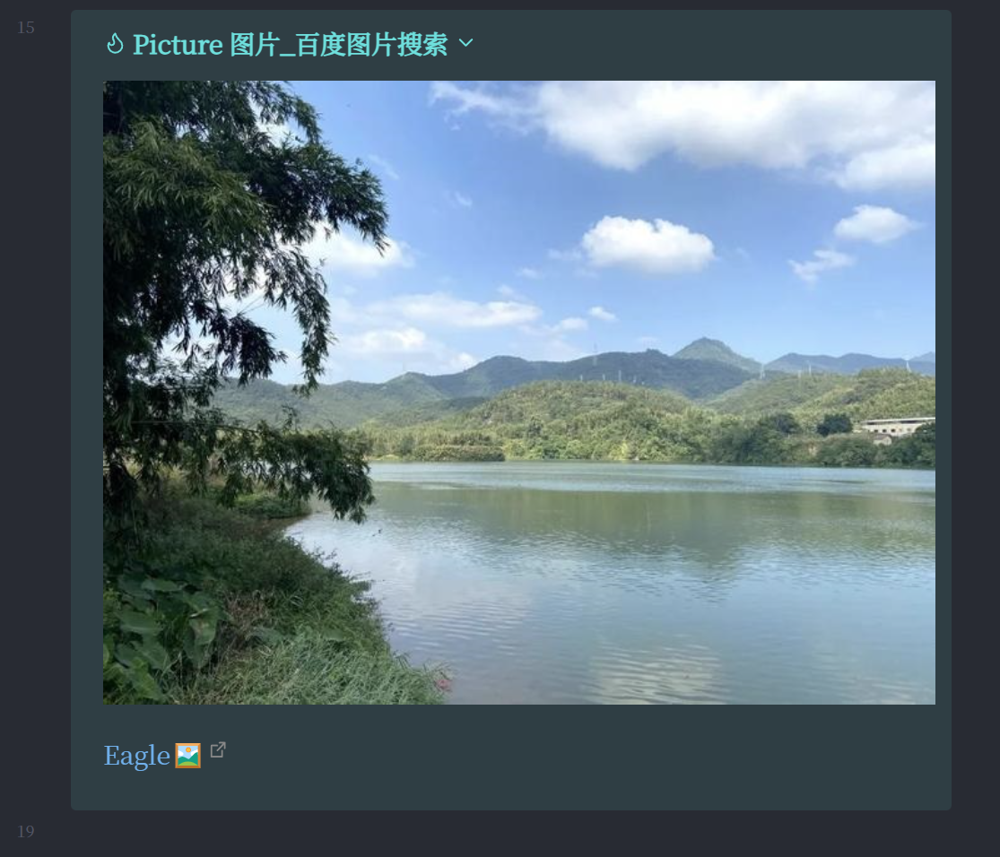

### 用Quicker设置Obsidian到Eagle的跳转、回链动作

用Quicker可以帮助我们完成一些繁琐的、需要多个操作步骤的动作。

这篇文章中，我用Quicker帮我完成从Eagle的复制图片到Obsidian文件夹、将链接按照callout格式复制到Obsidian笔记中，使之点击Obsidian中的链接能自动打开Eagle，并跳转到图片的所在位置。

其实我觉得这似乎没有太大的用处，之前的BookxNote、Zotero跳转到pdf文章的相应位置，是为了方便对照文章的上下文；但是Eagle就一张图片，跳转到Eagle的图片位置感觉么什么用。但还是写一下吧，万一有需要的人用到。

对于Eagle中图片的回链，可以右键点击图片，然后选择“复制链接”。

链接样式为：`eagle://item/LUJ9441DVAFRL`

但是到目前写这篇文章为止，我**没发现有快捷键可以复制这个链接**，需要手动右键点击复制。

虽然没有快捷键直接复制链接，但是观察链接样式可以发现，就是`eagle://item/`加上后面的一个item编号`LUJ9441DVAFRL`。然后我们打开Eagle在电脑中的文件夹可以发现，每张图片都是储存在以item编号为名的文件夹中，如下图：

所以我的思路是，复制图片的路径，然后从路径中提取出item编号，无论是用正则提取还是截取都行。然后在Eagle中，复制路径是有快捷键的，所以这就很方便在Quicker中用了。

例如复制文件路径得到：`C:\Users\Eagle\Eagle.library\images\LUJ9441DVAFRL.info\图片_百度图片搜索.jpg`。然后提取出`LUJ9441DVAFRL`，再在前面加上`eagle://item/`，得到完整链接`eagle://item/LUJ9441DVAFRL`，这与右键点击复制链接得到的是一样的。

摘录图片到Obsidian中Markdown的样式：

摘录图片到Obsidian中Excalidraw的样式：

点击Markdown、Excalidraw中的链接跳转到Eagle中的对应图片的位置：

制作Quicker动作的思路：

需要注意的是，当“检查笔记的附件文件夹中是否有同名图片？”这个步骤为“有”时，不同与之前的BookxNote、Zotero将原图片删除后复制新图片，这里**直接使用原图片**。

因为BookxNote、Zotero有时需要调整框选的笔记的大小，所以有同名文件时需要删除以达到**更新图片的作用**。而Eagle中的图片就是一张图片，不需要经常变大小，所以这里直接使用原图片。

例如下图，有时我们回顾笔记时，发现需要调整图片的大小。而Eagle就没有这个需求。

使用的方法：在Eagle选中图片，点击Quicker动作，到Obsidian里点击剪贴位置，然后按ctrl+v就可以了。我平时用Obsidian和Typora编辑文档，因此动作中加了识别Typora窗口的部分。

我将Quicker动作、不同的摘录情况的调试运行详情放到了[github仓库](https://github.com/operations4304/Eagle-Obsidian)

**但不幸的是，如果您直接用肯定是没法用的**。因为时间精力有限，没法做成普遍适用的动作。

所以这里提供的是实现的思路，以及可以参考的某些步骤的动作的写法。

如果你对图片的复制方式不清楚，可以查看这篇文章，[附件管理方式](https://zhuanlan.zhihu.com/p/690376509)，介绍了附加的储存情况。

谢谢观看！
